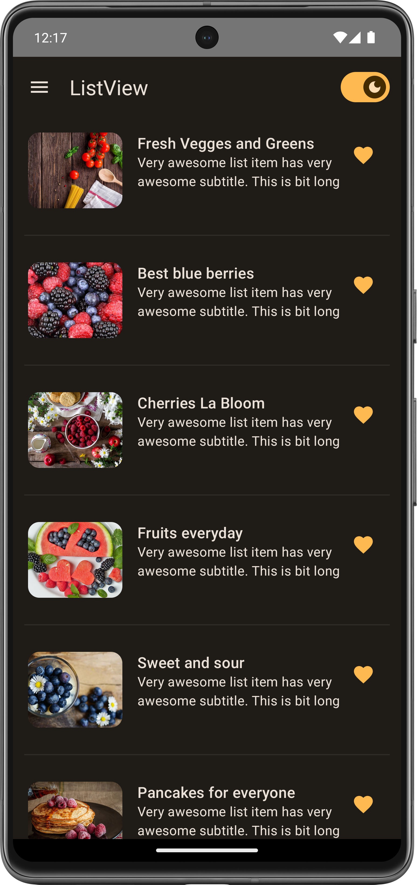
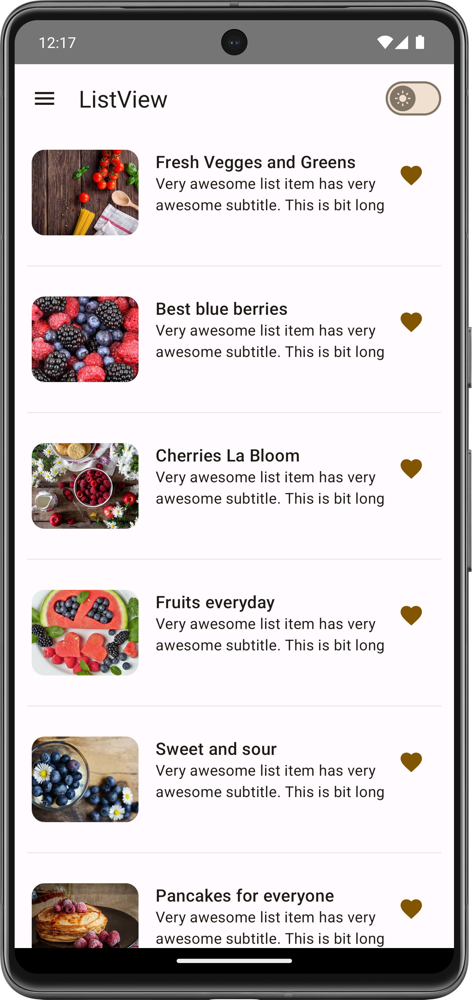

# Dark and Light Theme in Jetpack Compose

### This sample project demonstrates how to implement a dark and light theme switcher in an Android app using Jetpack Compose.

## Features

- Dark and light theme switcher.
- Clean and organized Jetpack Compose code.
- Easy-to-understand implementation.

## Screenshots

| Dark Theme | Light Theme | 
|------------|-------------|
|  |  |

|  Demo |
| -------------|
|  |

## Getting Started

To run this project locally, follow these steps:

1. Clone the repository:

   ```bash
   git clone https://github.com/yourusername/Dark-and-Light-Theme-in-Jetpack-Compose.git
2. Open the project in Android Studio.
3. Run the app on an emulator or physical device.

- Dependencies
Kotlin
Jetpack Compose
Contributing
If you'd like to contribute to this project, please follow these guidelines:

- Fork the repository.
Create a new branch.
Make your changes.
Submit a pull request.

- License
This project is licensed under the **MIT License** - see the LICENSE file for details.

Thanks to the Jetpack Compose community for inspiration and support.

